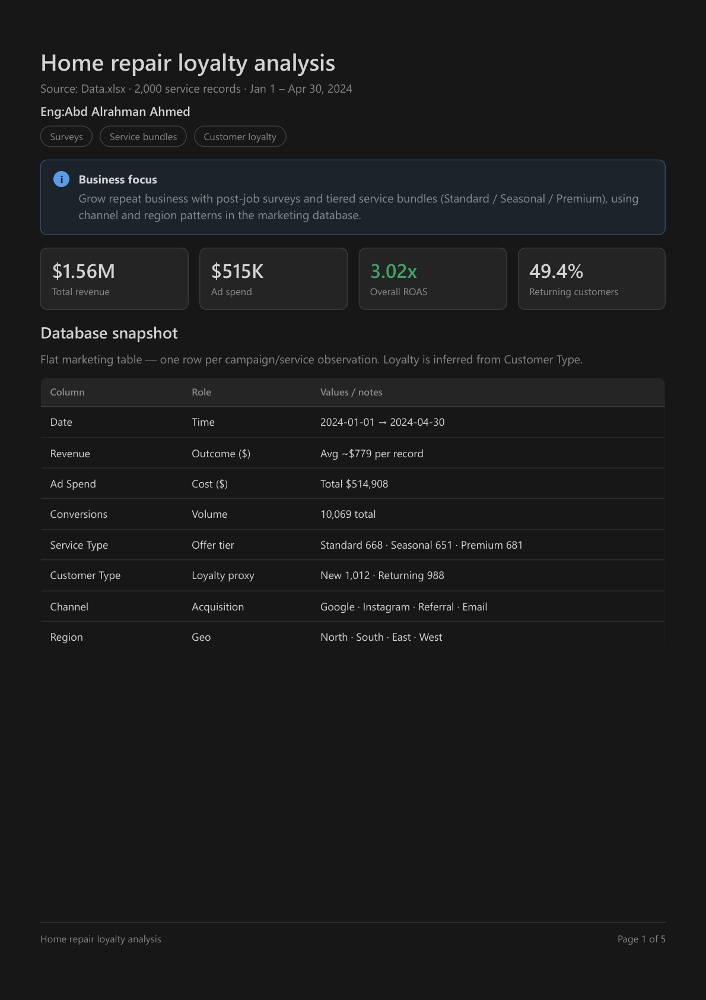
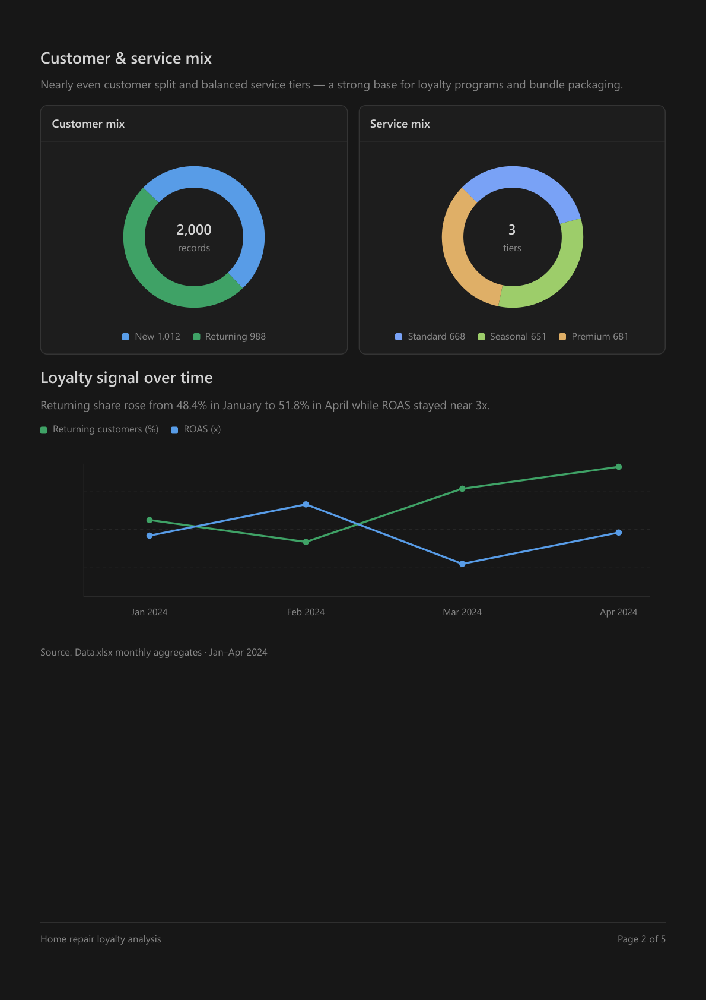
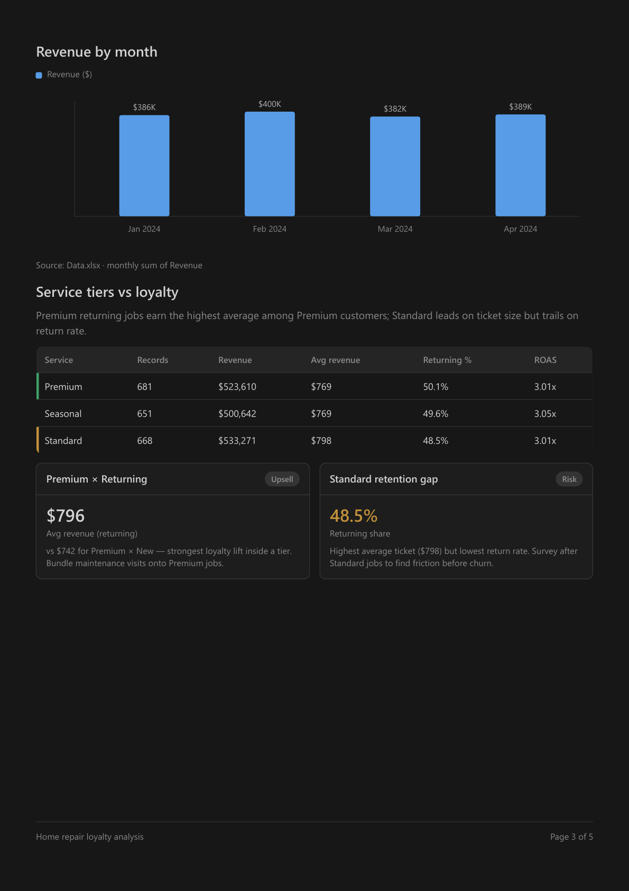
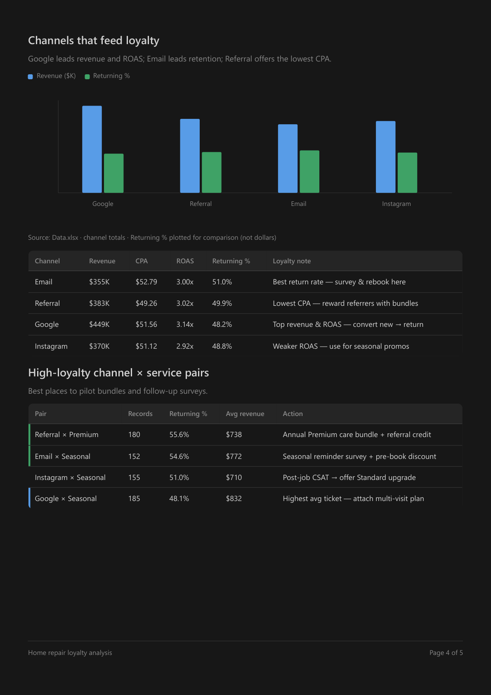
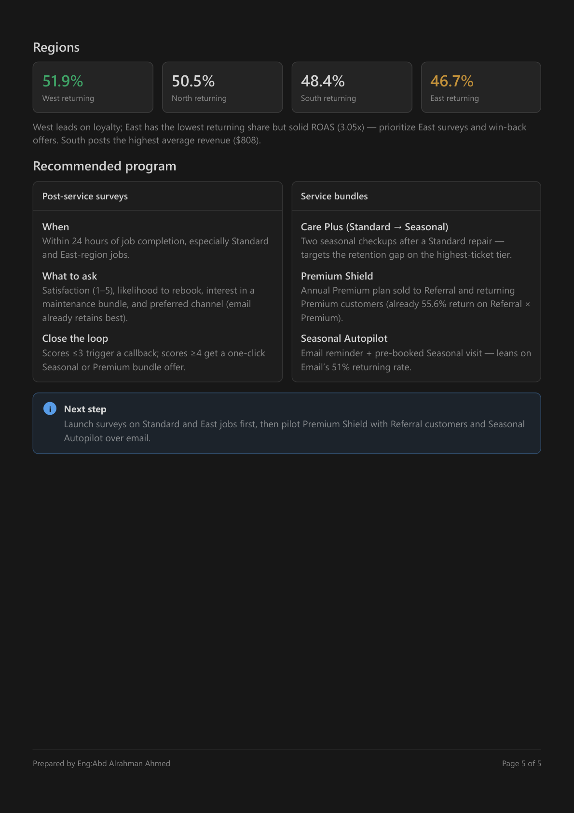

# Home Repair Loyalty Analysis

**Eng:Abd Alrahman Ahmed**

A home-repair company loyalty project focused on **post-service surveys** and **tiered service bundles**, built from real marketing data in `Data.xlsx`.

---

## Project summary

Goal: help a home-repair business grow **returning customers** through:

1. Surveys after every completed job  
2. Tiered service bundles (Standard / Seasonal / Premium)

Final deliverable: a dark visual report matching the Cursor Canvas look, exported as a fully black **5-page** PDF with no white margins.

---

## Repository contents

| Path | Description |
|------|-------------|
| `data/Data.xlsx` | Source database (2,000 records · Jan–Apr 2024) |
| `src/home-repair-loyalty.canvas.tsx` | Interactive Cursor Canvas analysis board |
| `report/loyalty-analysis-report.html` | Client HTML report matching the Canvas layout |
| `report/Home-Repair-Loyalty-Analysis.pdf` | Client-ready PDF |
| `assets/pdf-pages/page-01.png` … `page-05.png` | PNG exports of all 5 PDF pages |

### PDF page previews











---

## How this project was built

### 1) Understand the brief and the data

- Business idea: a home-repair company improving loyalty with surveys and bundles.  
- Inspected `Data.xlsx` with **Python + openpyxl**.  
- Columns: `Date`, `Revenue`, `Ad Spend`, `Conversions`, `Service Type`, `Customer Type`, `Channel`, `Region`.  
- Result: 2,000 clean rows, ~**$1.56M** revenue, **3.02x** ROAS, **49.4%** returning customers.

### 2) Calculate loyalty metrics

Python aggregations covered:

- Monthly revenue, ad spend, and conversions  
- Returning-customer share by month / channel / region / service type  
- Best Channel × Service pairs for pilot bundles and surveys  

Key findings:

- Email has the strongest retention (51% returning)  
- Referral × Premium is the strongest loyalty pair (55.6%)  
- Standard has the highest average ticket but the lowest return rate → survey priority  

### 3) Build the Cursor Canvas board

- Created `home-repair-loyalty.canvas.tsx` with `cursor/canvas` components  
  (Stat, Card, Table, PieChart, LineChart, BarChart, Callout, Pill).  
- The board shows the same metrics, tables, and recommendations beside the chat.

### 4) Convert the board into a client HTML report

- Because Canvas only runs inside Cursor, a standalone **dark HTML report** was built.  
- Charts are drawn with **SVG** (donuts / lines / bars).  
- Author line: `Eng:Abd Alrahman Ahmed`.

### 5) Export a fully black PDF

1. Open the HTML with **Google Chrome Headless**  
2. Print to PDF with `--no-pdf-header-footer`  
3. CSS setup:
   - `@page { margin: 0; background: #181818; }`
   - Fixed `.page-bg` layer fills every page with dark color  
   - `print-color-adjust: exact` so backgrounds stay dark in print  

This removes white margins so the PDF matches the Canvas look.

### 6) Export PDF pages as images

- Used **PyMuPDF (fitz)** to render each PDF page to PNG under `assets/pdf-pages/` for GitHub preview.

---

## Client recommendations

### Post-service surveys
- Send within 24 hours of job completion  
- Priority: Standard jobs and East region  
- Score ≤3 → callback · Score ≥4 → one-click bundle offer

### Suggested bundles
- **Care Plus:** two seasonal checkups after a Standard repair  
- **Premium Shield:** annual plan for Referral / returning Premium customers  
- **Seasonal Autopilot:** email reminder + pre-booked Seasonal visit

---

## How to run locally

### Open the HTML report

Open this file in a browser:

```text
report/loyalty-analysis-report.html
```

Use **Print / Save PDF** if you want to re-export.

### Regenerate the PDF with Chrome (Windows)

```powershell
$chrome = "C:\Program Files\Google\Chrome\Application\chrome.exe"
$html = (Resolve-Path ".\report\loyalty-analysis-report.html").Path
$uri = [Uri]::new($html).AbsoluteUri
& $chrome --headless=new --disable-gpu --no-pdf-header-footer --print-to-pdf="$PWD\report\Home-Repair-Loyalty-Analysis.pdf" "$uri"
```

### Extract PDF page images

```powershell
pip install pymupdf
python -c "import fitz; from pathlib import Path; out=Path('assets/pdf-pages'); out.mkdir(parents=True, exist_ok=True); doc=fitz.open('report/Home-Repair-Loyalty-Analysis.pdf');
[doc[i].get_pixmap(matrix=fitz.Matrix(2,2), alpha=False).save(out/f'page-{i+1:02d}.png') for i in range(doc.page_count)]"
```

### Inspect the Excel data

```powershell
pip install openpyxl
python -c "import openpyxl; wb=openpyxl.load_workbook('data/Data.xlsx', data_only=True); print(wb.sheetnames, wb.active.max_row)"
```

---

## Tech stack

- Python (`openpyxl`, `pymupdf`)  
- Cursor Canvas (`cursor/canvas` React components)  
- HTML / CSS / SVG  
- Google Chrome Headless (PDF export)  
- GitHub

---

## Prepared by

**Eng:Abd Alrahman Ahmed**
